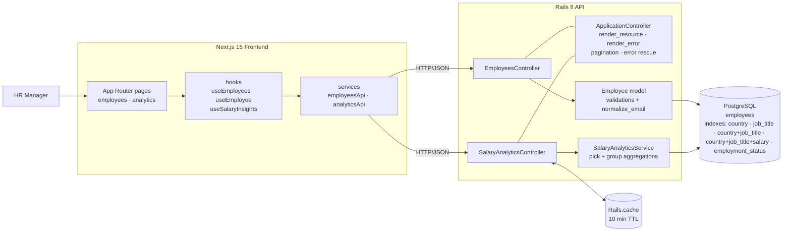
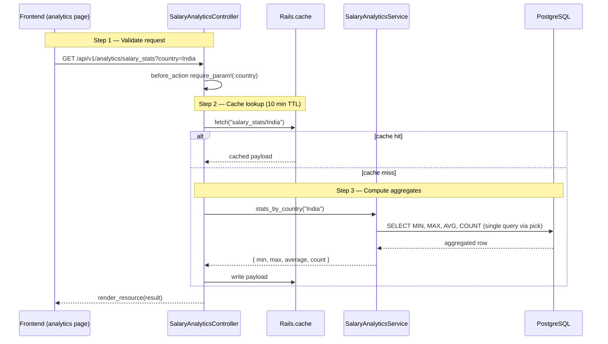
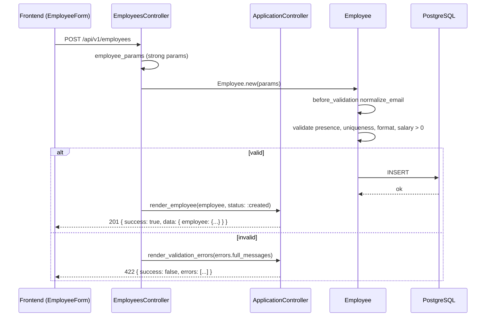
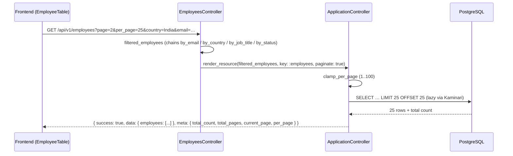

# Architecture Decisions

## System Diagrams

### High-Level Structure



### Salary Analytics Request Flow



### Employee Create Flow



### Employee Listing (paginated)



## Backend Architecture

### Why Rails API-only
- The doc requires a backend with a relational database. Rails provides convention-over-configuration which accelerates development while maintaining structure.
- API-only mode strips unnecessary middleware (sessions, cookies, views) keeping the stack lean.

### Why PostgreSQL
- Required salary aggregations (MIN, MAX, AVG, COUNT) are handled efficiently at the database level.
- `LOWER(email)` unique index ensures case-insensitive email uniqueness at the DB level, not just Rails validation.
- CHECK constraints (`salary > 0`) provide defense-in-depth beyond application-layer validation.

### Controller Design
- Controllers are thin — they handle request/response only.
- A shared `render_resource` helper in `ApplicationController` handles both single-record and paginated responses, wrapping every payload in a `{ success, data, meta? }` envelope.
- A dedicated `render_employee` wrapper in `EmployeesController` avoids repeating `key: :employee` at every call site.
- `before_action :set_employee` extracts record lookup for show/update/destroy.
- A lambda `before_action -> { require_param!(:country) }` in `SalaryAnalyticsController` centralizes required-param validation.
- `filtered_employees` private method chains the `by_email` (exact match), `by_country`, `by_job_title`, `by_status` model scopes only when the matching params are present.

### Service Layer
- `SalaryAnalyticsService` encapsulates all salary aggregation logic with optimized SQL queries.
- `stats_by_country` uses `pick()` to fetch `MIN, MAX, AVG, COUNT` in a single query instead of 4 separate calls.
- `average_by_job_title` returns a unified `{ average, titles }` shape. `titles` is the full per-title ranking (computed via `.group(:job_title).average(:salary)` + Ruby-side sort); `average` is the scalar for the requested title (found in the `titles` list, no second query).

### Seeding Strategy
- Seed logic lives in `db/seeders/employee_seeder.rb`, not in `app/services/` — it's a data loading concern, not business logic.
- Fixture data (countries, job titles, first/last names) lives in `db/data/fixtures/` for easy modification without code changes.
- Per-job-title salary bands defined inline as the frozen `SALARY_RANGES` constant with `DEFAULT_SALARY_RANGE` fallback so an Intern doesn't earn Director money.
- Country × job_title combinations assigned via `Array#cycle` — every country gets every title evenly, no modulo math.
- `upsert_all(unique_by: :index_employees_on_lower_email)` in batches of 1,000 within a per-batch transaction — re-running the seeder updates existing rows instead of duplicating them. Completes in under 10 seconds.
- `Employee.delete_all` is gated to `Rails.env.development?` — other environments upsert without wiping.
- Frozen constants (`DATA_PATH`, `SALARY_RANGES`, `DEFAULT_SALARY_RANGE`) guard against accidental mutation.

## Frontend Architecture

### Why Next.js 15 + Ant Design
- Next.js provides App Router with file-based routing — maps cleanly to the two main pages (employees, analytics).
- Ant Design provides production-ready components (Table with pagination, Form with validation, Modal, Select, Statistic cards) out of the box.
- Recharts for salary visualizations — lightweight and composable.

### Project Structure
```
src/
├── app/            Pages (employees, employees/[id], analytics)
├── components/     AppShell, EmployeeTable, EmployeeForm, Loader
├── hooks/          useEmployees, useEmployee, useSalaryInsights
├── services/       employeesApi, analyticsApi
├── types/          Shared TypeScript interfaces (Employee, EmployeeFilters, PaginationMeta, …)
├── constants/      Routes, API paths, countries, job titles, employment statuses
├── lib/            Axios instance + response interceptor (unwraps the envelope)
└── styles/         Global CSS
```

### Key Decisions
- Types extracted into `src/types/` — single source of truth for Employee, EmployeeFilters, PaginationMeta, SalaryStats, etc.
- `useEmployees` hook encapsulates fetch logic with `page`, `per_page`, and optional filters (`email`, `country`, `job_title`, `employment_status`).
- `EmployeeTable` is a presentational component — receives data and callbacks, no internal state.
- `EmployeeForm` auto-maps country to currency using a shared `COUNTRY_CURRENCY` constant.
- Fixed sidebar with sticky page headers — only content area scrolls.
- Per-page size changer (10/25/50/100) + exact-email input + 3 filter selects (country / job title / status) wired end-to-end from UI to API.
- `lib/api.ts` installs an axios response interceptor that unwraps `{ success, data, meta }` so services and hooks see the inner payload directly.

## Database Design

```
employees
├── full_name         (string, NOT NULL)
├── email             (string, NOT NULL, LOWER unique index)
├── job_title         (string, NOT NULL, indexed)
├── country           (string, NOT NULL, indexed)
├── salary            (decimal 10,2, NOT NULL, CHECK > 0)
├── currency          (string, default "USD")
├── employment_status (string, NOT NULL, default "active", indexed, enum)
├── date_of_joining   (date)

Indexes: country · job_title · country+job_title · country+job_title+salary · email+country+job_title+employment_status · employment_status · LOWER(email) unique
```

### Why these indexes
- `country` — every analytics query filters by country.
- `job_title` — `by_job_title` filter when country is not specified (leftmost-prefix rule means the composite can't serve this query).
- `country+job_title` — composite index covers the `average_by_job_title` group-by pattern.
- `country+job_title+salary` — covering index for aggregate queries; PostgreSQL can satisfy MIN/MAX/AVG via an index-only scan without touching the heap.
- `email+country+job_title+employment_status` — covers the list endpoint's full filter combination (exact email + filters) in a single index lookup.
- `employment_status` — HR managers frequently filter by status.
- `LOWER(email)` unique — case-insensitive email uniqueness enforced at the DB; also used as the conflict target for `upsert_all` in the seeder.

## API Design

Three endpoint groups with consistent patterns:
- **Employees CRUD** — standard REST. Payload keyed by resource name (`employee` / `employees`) inside the envelope. Listing accepts `page`, `per_page`, `email` (exact match), `country`, `job_title`, `employment_status`.
- **Analytics** — read-only endpoints returning aggregated data. `salary_by_job_title` always returns `{ average, titles }`; the `average` scalar is populated only when `job_title` is passed. All analytics responses cached via `Rails.cache.fetch` (10-minute TTL).
- **Error handling** — centralized in `ApplicationController` with `StandardError → 500`, `RecordNotFound → 404`, `ParameterMissing → 400`.

### Response envelope

Every response follows the same shape so the frontend can parse uniformly.

Success (single / analytics):
```json
{ "success": true, "data": { "employee": { ... } } }
```

Success (paginated):
```json
{
  "success": true,
  "data": { "employees": [ ... ] },
  "meta": { "total_count": 128, "total_pages": 6, "current_page": 1, "per_page": 25 }
}
```

Validation errors (array):
```json
{ "success": false, "errors": ["Email has already been taken", "Salary must be greater than 0"] }
```

Single error (param missing, not found, server error):
```json
{ "success": false, "error": "country param is required" }
```

The frontend `lib/api.ts` installs an axios response interceptor that unwraps `{ success, data, meta }` so downstream services and hooks see the inner payload directly (plus a lifted `meta` for paginated responses).
